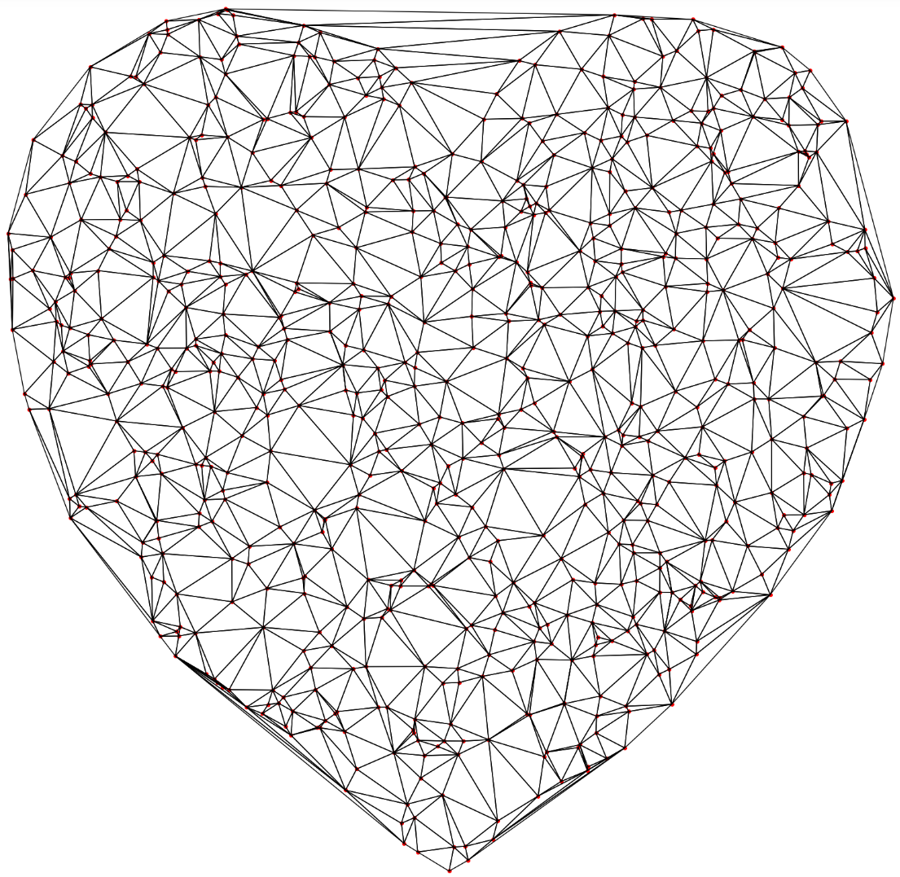

# Алгоритм триангуляции Делоне

## Триангуляция
Триангуляция множества точек на плоскости - это неориентированный граф, в котором пары точек соединены ребром, любая конечная грань образует треугольник, ребра не пересекаются, и граф максимален по количеству ребер.

## Триангуляция Делоне
Триангуляцией Делоне - это Триангуляция, в которой для любого треугольника верно, что внутри описанной около него окружности не находится точек из исходного множества, кроме точек, являющихся вершинами этого треугольника.

## Примеры триангуляции Делоне

# Круг

# Сердечко

